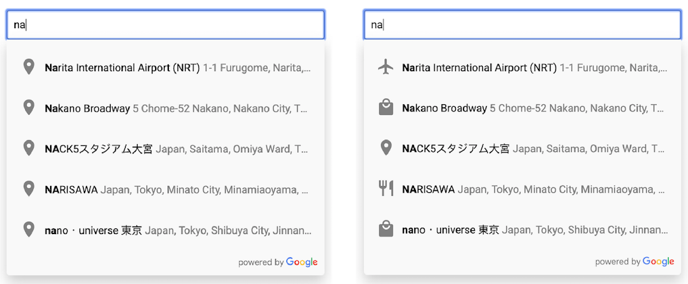
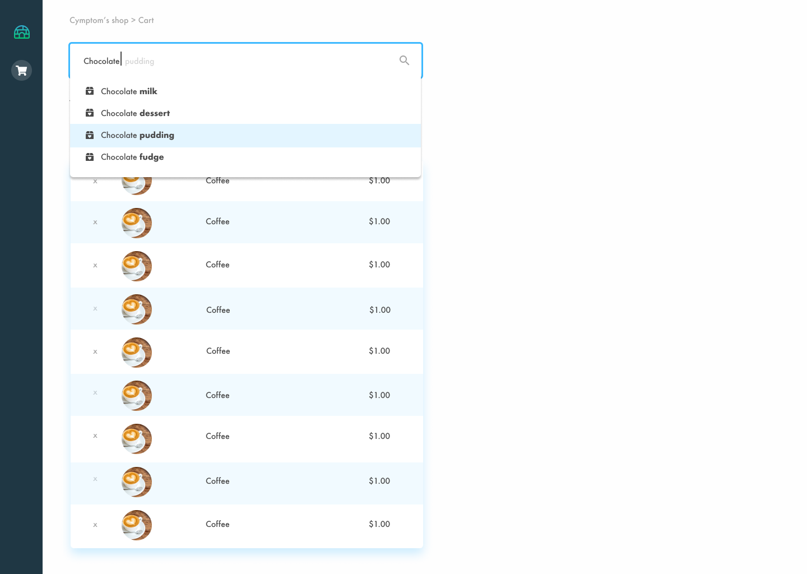

&nbsp;

# Shopping cart task summary

You are going to build a simple "shopping" page where the user can enter product names he wishes to buy, and receive suggestions based on his input (auto-complete). When an item is selected, that item will be added to the cart dynamically.

Note that whenever the user types something, a request will be sent to a NodeJS server, that will filter and fetch the data based on the user's input.

## Frontend Requirements

The framework we are going to use on the frontend will be Angular 8+.
Build a webpage containing the following components:

### Autocomplete

Build an autocomplete component that contains the following features:

- Fetches autocomplete data from NodeJS server. On each keystroke, new data will be fetched from the server (showing at least 20 products), the data must be filtered on the server side. For each change in the autocomplete, new data will be fetched from the server.

- When the user hits enter to select an item, the selected product from the autocomplete will be added to the cart table. Make sure the up/down arrow keys allow you to navigate between the autocomplete suggestions (focusing and highlighting an item). The Enter key will add the selected item to the cart table. The user may also use the mouse to select items.

- Make sure when navigating between items, if an item is selected by the user and out of the viewport, it will automatically scroll to it.

- **Make sure to use Angular framework system features, like data binding, inputs, outputs, services, directives and pipes (if and as required, use whatever fits the needs)**.

**DO NOT USE ANY NPM PACKAGE FOR THE AUTOCOMPLETE, YOU MUST BUILD THE AUTOCOMPLETE COMPONENT BY YOURSELF.**

Here is an example of google maps autocomplete component:

### Shopping items table

Build a simple HTML table which renders only the items added to the cart table from the autocomplete. It must show the following rows: "Name, Price, Picture (``)".  The user may also remove items from the cart table using an 'X' button for each row.

## Backend Requirements

You must use NodeJS with Express for the server side.

You are provided a file called 'products.json' (found under `assets/products.json`) in the repository, use it to load the product list into your NodeJS server.

On the server side, simply create an API which allows fetching the products that match the filtered keyword.

For example, if the user types the query "co", all the products matched for this phrase will be returned with their data (for example: coat, gaming console, tobacco) .

## General Requirements

- You should work with GitHub repository to store and manage your code.
- You should be using Angular 8+ and NodeJS typescript.
- You are required to write your code using OOP concepts
- Document your code as much as needed
- **Make sure your code is easy to read and understand.**

## Before starting this task

- Fork this repository ([https://github.com/cymptomlabs/fullstack-task](https://github.com/cymptomlabs/fullstack-task)).
- Send a link to the forked github repository to: itamar@cymptom.com .

**Good luck!**

*An example of the task*

